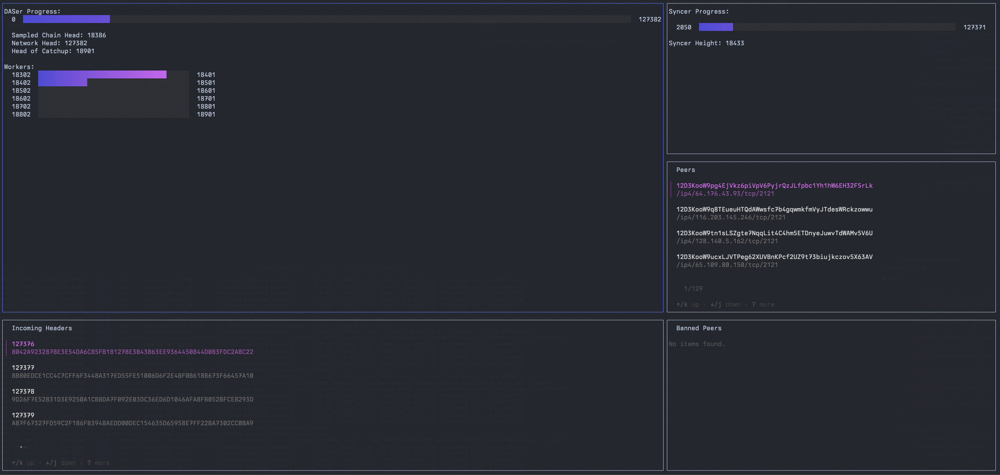

 # Celestia DA TUI
 Celestia DA TUI uses the celestia-node RPC client to fetch data from the node and display it in a TUI. This first POC is written using the bubbletea library and is very much a WIP.

It has panels for DASer status, header sync status, peers, and incoming headers. It currently runs on an unreleased version of celestia-node, which has support for streaming extended headers over the RPC.



### USAGE:
```bash
go run main.go ws://localhost:26658 $AUTH_TOKEN
```

### Keycodes:
- `tab` cycles through panels
- `ctrl-c` exits the program
- `b` blocks the selected peer
- `u` unblocks the selected peer
- `hjkl` navigates through the active tabs list and pagination
